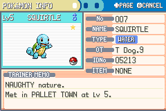
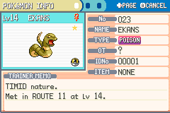

# mgba-scripts

This provides a profile aware Lua automation layer for English gen III Pokemon releases, combining deterministic RNG introspection, hardware derived frame telemetry, shiny frame acquisition, battle automation, Pickup farming, and encounter verification inside stock mGBA.

Each public launcher remains self contained and delegates shared behavior to revision aware memory maps plus bounded asynchronous search workers and encrypted party readers alongside conservative state machines that stop whenever cartridge evidence becomes ambiguous.

## Demonstrations

<table>
  <tr>
    <td></td>
    <td></td>
  </tr>
</table>

## Supported cartridges

The launcher validates the ROM header and normalizes the reported game code before applying revision specific addresses so an incorrectly selected supported launcher can still resolve the cartridge without silently combining incompatible memory layouts.

| Launcher | Header code | RNG origin model | Static frame convention |
|---|---:|---|---|
| `Emerald.lua` | `BPEE` | Fixed initial seed `00000000` | PokeFinder Method 1 advances |
| `Ruby.lua` | `AXVE` | Live session seed becomes frame zero | PokeFinder Method 1 advances |
| `Sapphire.lua` | `AXPE` | Live session seed becomes frame zero | PokeFinder Method 1 advances |
| `FireRed.lua` | `BPRE` | Timer1 derived 16 bit boot seed | Direct PokeFinder advances without hidden offsets |
| `LeafGreen.lua` | `BPGE` | Timer1 derived 16 bit boot seed | Direct PokeFinder advances without hidden offsets |

Only English retail compatible ROM layouts are supported because localized releases relocate save blocks and task structures alongside callback functions plus encounter tables and species metadata enough to produce plausible but technically incorrect diagnostics.

## Install

1. Download or clone the repository while preserving the root launchers, `assets` directory, and `lib` hierarchy exactly, because the scripts resolve shared modules relative to the selected launcher's filesystem location.
2. Open the matching ROM in mGBA, choose **Tools → Scripting**, select the corresponding launcher, and keep the scripting window open while Capture, Battle, Pickup, or Hunter is operating.
3. Use an mGBA build with Lua scripting support, preferably version `0.10` or newer; development verification used `0.11-9122-afd6f14ea`, although no nightly-only API is intentionally required.

No executable, bundled ROM, injected DLL, external timer, or background service is required, because every runtime decision is made through mGBA's Lua API and the loaded cartridge's own emulated memory.

## Capture and shiny frame targeting

Capture separates the hardware video frame domain from the cartridge RNG advance domain so frontend callback multiplicity and lag frames together with menu polling or repeated KEYINPUT reads cannot masquerade as equivalent linear congruential generator calls.

| Control | Operation |
|---|---|
| `F` | Scan the active seed and trainer identity for a valid shiny target |
| `G` | Enter or replace a target frame manually |
| `M` | Toggle Starter and Wild interpretation |
| `I` | Inspect the currently visible Pokemon immediately |
| `Q` | Clear transient hit diagnostics before another attempt |
| `Ctrl+P` | Toggle mGBA pause while anchoring Capture's logical stepping state |
| `Ctrl+N` | Advance exactly one displayed `Current Frame` per physical key press |

Starter scans begin at absolute frame zero and evaluate candidates monotonically before stopping on the first shiny PID which means Capture chooses the mathematically smallest valid frame instead of a future frame after an already advanced session.

Wild scans remain forward-only and begin from the live encounter state with a small execution lead, because a past wild construction boundary cannot be revisited without restoring state or resetting the relevant RNG context.

The shiny predicate follows the retail Generation III definition, where `TID XOR SID XOR PID_low XOR PID_high` must be smaller than eight; cached labels are never trusted after trainer identity changes.

Every selected target is bound to its initial seed plus Trainer ID and Secret ID so a soft reset or session discontinuity and delayed SaveBlock2 resolution or profile replacement invalidates stale calibration before scheduling another scan.

For FireRed and LeafGreen, the displayed target frame now uses PokeFinder's direct Method 1 advance convention; for example, seed `10E9`, TID/SID `31226/14470`, and frame `8322` resolve to shiny PID `7255332B`.

### Understanding the Capture fields

`Current Frame` is sourced from `gMain.vblankCounter2`, whereas `Advances` tracks LCRNG progression from the game's appropriate origin; these counters answer different questions and are intentionally allowed to diverge during menus, animations, and repeated input polling.

`Hit Frame` identifies the frame reconstructed from the generated Pokemon's PID or complete encounter spread, while `Miss` records signed timing displacement and `Adjusted Offset` accumulates the inverse correction required for the following attempt.

`Corrected Frame` is therefore the next calibrated input frame, not evidence that the previously generated Pokemon was shiny; the target PID line independently reports whether the active seed and trainer identity satisfy the shiny predicate.

## Runtime scheduling and frame semantics

The incremental scanner processes at most 256 candidates during one emulated callback and yields after approximately one millisecond so unbounded fast forward cannot monopolize frontend dispatch or freeze the mGBA scripting console.

Capture reads the hardware VBlank counter once per callback, redraws ordinary telemetry at a bounded cadence, and polls encrypted party Pokemon at roughly ten hertz, preserving responsive frame progression without repeatedly decrypting six full party structures.

Paused stepping uses a logical edge triggered clock that debounces held keys and collapses duplicate callbacks before reconciling `keysRead` fallback observations then rendering immediately because a paused emulator cannot provide a later repaint callback.

## Battle, Pickup, and Hunter

Battle exposes profile-specific combat automation while respecting move availability, health thresholds, battle-controller callbacks, evolution prompts, replacement-move tasks, and active-battler ownership instead of issuing blind menu timings across incompatible game families.

Pickup combines collection, farming, and storage maintenance, deposits eligible inventory into PC item storage when bag capacity becomes constrained, and resumes its previous farming state after the transfer transaction completes successfully.

When health reaches twenty percent or total usable move PP falls to three, Pickup performs an in-place recovery transaction that restores party health, status, and PP without pathfinding to a Pokemon Center or interrupting the farming route.

Hunter coordinates verified encounter automation and refuses to continue when expected species, PID, trainer identity, save context, or generation hooks disagree, because a false-positive shiny result is materially worse than a conservative stop.

Use the numbered tool entries in mGBA's scripting window, or the displayed keyboard controls, to switch between Capture, Battle, Pickup, and Hunter; changing tools automatically releases synthesized input before transferring ownership.

## Verification

The release suite performs syntax validation over every Lua source alongside deterministic LCRNG vectors and physical `Ctrl+N` edge tests with duplicate callback reconciliation plus live seed rebinding and trainer identity rebinding and smallest frame proofs.

Pokebot's English master-state corpus contributed 147 disposable savestates spanning overworld, daycare, fishing, Safari, puzzle, roamer, static, starter, Sweet Scent, and scripted-event contexts; every state preserved exact one-VBlank Capture progression.

| Game | Profile states | Capture result | Live scan/rebind result | Encounter evidence |
|---|---:|---:|---:|---|
| Emerald | 37 | 37/37 | Pass, fixed-seed invariant verified | Species-locked wild shiny verified |
| Ruby | 29 | 29/29 | Pass, session restart and TID/SID rebind verified | Starter and wild shinies verified |
| Sapphire | 30 | 30/30 | Pass, session restart and TID/SID rebind verified | Starter and wild shinies verified |
| FireRed | 26 | 26/26 | Pass, Timer1 seed and TID/SID rebind verified | Starter and wild shinies verified |
| LeafGreen | 25 | 25/25 | Pass, Timer1 seed and TID/SID rebind verified | Starter and wild shinies verified |

Headless encounter evidence additionally verified shiny FireRed starter acquisition and species locked shiny Ekans capture through the real battle interface while screenshots sampled directly from mGBA preserve acquisition text plus capture confirmation and summary stars.

## Operational cautions

Save states and runtime settings together with generated checkpoints plus ROM images and battery saves remain excluded from version control because deterministic test fixtures never justify publishing copyrighted cartridge data or mutable user profiles.

Always verify the displayed seed, TID/SID, target PID, and `SHINY` label before committing an attempt; manually entered frames can be exact yet non-shiny when copied from another boot seed or trainer profile.

This project does not distribute copyrighted game data, and users are responsible for supplying legally obtained ROM dumps whose language, revision, and header code match the supported profile matrix.
